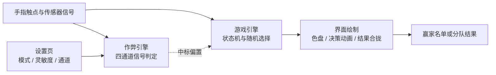

# Cheatwazi

复刻原版 Chwazi 手指挑选玩法，并支持通过隐蔽的物理信号把结果“内定”给指定的人的 Android 应用。


## 简介

多人围着一台手机把手指按到屏幕上，让 app 随机挑出一个人——谁去买单、谁先来、谁当鬼。Cheatwazi 复刻了原版 Chwazi 的完整玩法，并在其之上加了一层“作弊引擎”：作弊者本人只需做出一个旁人难以察觉的自然动作，就能让结果偏向自己或指定的某个人。关键设计约束是：不开作弊时，行为与真随机无差别，不用担心被朋友用统计手段识破。

本项目仅供学习交流使用 · 玩法与美术版权归原版 Chwazi 作者所有。

预览图由 `tools/render_preview.py` 按真实绘制规格离屏渲染：

| 等待 | 读条 | 结果揭晓 |
|---|---|---|
|  |  |  |

## 特性

- 界面与决策动画逐项还原原版 Chwazi
- 两种模式：选出 1-8 个赢家，或随机分成 2-5 队
- 作弊通道四选一（设置页单选互斥）：按压 / 倾斜指向 / 快速微抬 / 序号内定
- 设备自检前置：未完成自检不能启用作弊，不支持的通道自动禁用并说明原因
- 三档灵敏度：隐蔽 / 标准 / 灵敏，滑条下方实时显示各通道的触发阈值
- 隐蔽入口：在等待界面用手指画一个小三角形进入设置，游戏画面与原版无异
- 轻量干净：约 770KB，零第三方 SDK，不申请网络权限

## 快速开始

### 环境要求

- JDK 17（Temurin 实测通过）
- Android SDK：platforms;android-34、build-tools;34.0.0
- Gradle 8.7

### 构建

```bash
gradle test assembleRelease
```

产物位于 `app/build/outputs/apk/release/app-release.apk`。签名配置从 `local.properties` 读取，首次构建前需自行准备 keystore 并在其中填写路径与密码。

### 安装

将 APK 传到手机安装（Android 7.0+），或连接后执行：

```bash
adb install app/build/outputs/apk/release/app-release.apk
```

## 使用

### 基础用法

手指按住屏幕即加入，人齐后自动倒计时出结果；有人中途加入或离开会自动重新倒计时。模式与人数在主界面顶栏 FINGERS / GROUPS 切换。结果会一直保持，全部松手约 1.2 秒后自动回到等待界面。

### 进阶用法

- 进入设置：在等待界面用手指画一个小三角形
- 作弊通道（设置页四选一，单选互斥，需在读条约 3 秒内生效）：
  - 按压——按压力度大获胜，多人重按则按力度取前 N 名
  - 倾斜——把手机朝获胜者那侧压低半秒
  - 微抬——手指快速抬起再按回，多人可同时各自指定自己
  - 序号——勾选后下一局第 N 个放手指的人赢，用一次自动失效
- 两种模式都有效：选赢家必进名单，分队固定进第 1 组
- 灵敏度：三档滑条，实时显示各通道的触发阈值
- 自检：建议先在设置页自检区确认压力通道是否可用；无信号时随机选择获胜者

## 架构

### 文件结构

```text
Cheatwazi/
├── app/
│   └── src/
│       ├── main/
│       │   ├── java/com/cheatwazi/app/
│       │   │   ├── Pointer.kt           # 触点模型与压力 / 面积采样
│       │   │   ├── GameEngine.kt        # 游戏状态机与随机选择
│       │   │   ├── CheatEngine.kt       # 作弊信号判定（四通道）
│       │   │   ├── ChwaziView.kt        # 主界面自定义绘制与决策动画
│       │   │   ├── SettingsActivity.kt  # 设置页
│       │   │   ├── Prefs.kt             # 偏好持久化
│       │   │   └── MainActivity.kt      # 入口
│       │   ├── res/                     # 界面资源与内置音效
│       │   └── AndroidManifest.xml
│       └── test/                        # JVM 单元测试与蒙特卡洛模拟
├── tools/                               # 预览图渲染、音效生成脚本
├── docs/                                # README 预览图
├── build.gradle.kts                     # 根与模块构建配置
└── CHANGELOG.md
```

### 架构图



纯 Kotlin 逻辑层（`Pointer` / `GameEngine` / `CheatEngine`）与 Android UI 层（`ChwaziView` 自定义绘制）完全解耦，引擎不持有任何 Android 依赖，全部判定逻辑可在 JVM 上直接单元测试与蒙特卡洛模拟。三条动作通道的阈值均以触点按下初期 350ms 的采样中位数为基线做相对比较，天然免疫不同设备压力单位、接触面积算法与手指大小的差异。技术栈为 Kotlin + Android View 自绘，运行时仅依赖 androidx 两件套。

## 常见问题

- 按压通道没反应？先在设置页自检区确认设备是否上报真实压力值；部分机型触屏不提供压力数据，该通道会自动禁用并说明原因。
- 不开作弊会被统计手段识破吗？不会。选中分布通过 20000 局蒙特卡洛模拟测试背书，无信号、传感器噪声注入等场景均有自动化测试覆盖。
- 覆盖安装失败？签名不一致导致，请使用同签名 APK 覆盖升级。

### 已知限制

- 作弊信号必须在读条约 3 秒内给出，读条结束后无效
- 序号内定为一次性，用一局自动失效

## 许可证

MIT，见 [LICENSE](LICENSE)。

## 致谢

- 灵感来源 / 参考项目：原版 Chwazi（手指挑选 app），玩法与视觉交互的复刻对象
- 使用的开源组件：androidx.appcompat 与 androidx.core-ktx（Apache-2.0，UI 基础）、JUnit（EPL-1.0，单元测试）
- 贡献者：@yishi-gh，全部设计与实现；@treblamai，提出改进需求并参与测试（issue #1）
