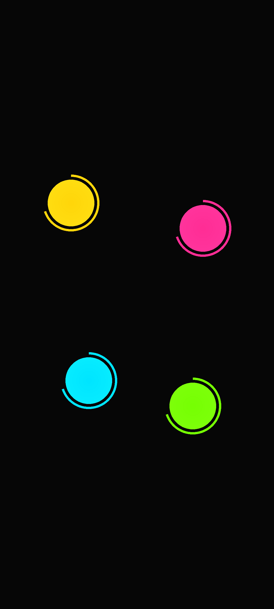

# Cheatwazi

复刻原版 Chwazi 手指挑选玩法，并支持通过隐蔽的物理信号把结果"内定"给指定的人。


## 简介

多人围着一台手机把手指按到屏幕上，让 app 随机挑出一个人——谁去买单、谁先来、谁当鬼。Cheatwazi 复刻了原版 Chwazi 的完整玩法，并在其之上加了一层"作弊引擎"：作弊者本人只需做出一个旁人难以察觉的自然动作，就能让结果偏向自己或指定的某个人。

作弊通道在设置里四选一（按压 / 倾斜 / 微抬 / 序号）：按压力度大获胜；把手机朝获胜者那侧压低半秒；手指快速抬起再按回；或直接预定下一局第 N 个放手指的人赢。前三条基于触点自身按下初期的基线做相对判定，不依赖特定硬件数值，动作请保持自然。

关键设计约束是：**不开作弊时，行为与真随机无差别**。选中分布通过 20000 局蒙特卡洛模拟测试背书，无信号、传感器噪声注入等场景均有自动化测试覆盖，不用担心"被朋友用统计手段识破"。

本项目仅供学习交流使用 · 玩法与美术版权归原版 Chwazi 作者所有。

## 预览

预览图由 `tools/render_preview.py` 按真实绘制规格离屏渲染：

| 等待 | 读条 | 结果揭晓 |
|---|---|---|
|  |  |  |

决策动画为两圈：色环张开一圈后接浅色读条弧一圈，弧随盘旋转；出结果后赢家色合拢全屏、只在其圆点处留孔露出呼吸的圆，全部松手约 1.2 秒后自动退回等待界面。

## 特性

- 原版同款：顶栏 FINGERS / GROUPS 模式菜单、大色盘 + 粗外环的触点样式、持续呼吸、色环 / 读条弧两圈单向张开且随盘旋转的决策动画、结果色彩合拢留孔与黑色扩散退出
- 两种模式：选出 1-8 个赢家，或随机分成 2-5 队
- 作弊通道四选一（设置页单选互斥）：按压（多人重按则按力度取前 N 名）/ 倾斜指向（可指定获胜者）/ 快速微抬（多人可各自指定自己）/ 序号内定（一次性，下一局第 N 个放手指的人赢，用一次自动失效）
- 设备自检前置：未完成自检不能启用作弊，不支持的通道自动禁用并说明原因
- 三档灵敏度：隐蔽 / 标准 / 灵敏，滑条下方实时显示各通道的触发阈值
- 隐蔽入口：在等待界面用手指画一个小三角形进入设置，游戏画面与原版无异
- 轻量干净：约 770KB，零第三方 SDK，不申请网络权限

## 快速开始

### 环境要求

- JDK 17（Temurin 实测通过）
- Android SDK：platforms;android-34、build-tools;34.0.0
- Gradle 8.7

### 构建

```bash
gradle test assembleRelease
```

产物位于 `app/build/outputs/apk/release/app-release.apk`，使用 `local.properties` 中配置的 keystore 签名（文件本体默认存放在项目外，密码不入库），可直接安装。若自行换签，注意同签名才能覆盖升级。

### 安装

将 APK 传到手机安装（Android 7.0+），或连接后执行：

```bash
adb install app/build/outputs/apk/release/app-release.apk
```

### 使用说明

基本玩法：手指按上屏幕，人齐后色环先张开一圈，浅色读条弧再张开一圈，扫满出结果；两圈弧随盘旋转，有人加入或离开时旧读条弧缩回、全员重新接力。模式与人数点主界面顶栏 FINGERS / GROUPS 直接切换。

· 进入设置 —— 主界面画三角形
· 模式与人数 —— 主界面顶部 FINGERS / GROUPS 直接切换
· 作弊通道四选一 —— 按压 / 倾斜 / 微抬 / 序号，在读条的约 3 秒内生效
· 按压 —— 按压力度大获胜；多人重按则取前 N 名
· 倾斜 —— 手机朝获胜者侧压低半秒
· 微抬 —— 手指快速抬起再按回；多人可同时各自指定自己
· 序号 —— 勾选后下一局第 N 个放手指的人赢，用一次自动失效
· 两种模式都有效 —— 选赢家必进名单，分队固定进第 1 组

结果不松手就一直保持，全部松手约 1.2 秒后自动退回等待界面。建议先用自检区确认压力通道是否可用；无信号时随机选择获胜者。

## 工作原理

纯 Kotlin 逻辑层（`Pointer` / `GameEngine` / `CheatEngine`）与 Android UI 层（`ChwaziView` 自定义绘制）完全解耦，引擎不持有任何 Android 依赖，全部判定逻辑可在 JVM 上直接单元测试与蒙特卡洛模拟。三条通道的阈值均以触点按下初期 350ms 的采样中位数为基线做相对比较，天然免疫不同设备压力单位、接触面积算法与手指大小的差异。

## 许可证

MIT，见 [LICENSE](LICENSE)。
